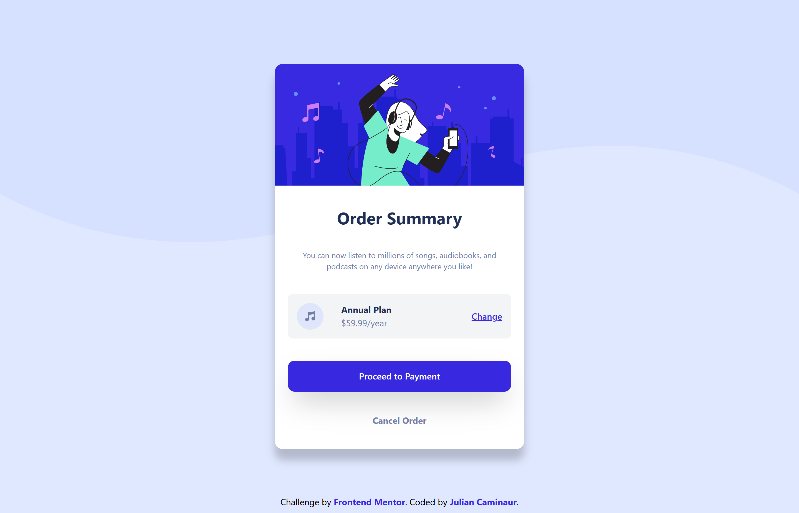

# Frontend Mentor - Order summary card solution

## Table of contents

- [Overview](#overview)

  - [The challenge](#the-challenge)
  - [Screenshot](#screenshot)
    - [Desktop](#desktop)
    - [Mobile](#mobile)
  - [Links](#links)

- [My process](#my-process)

  - [Built with](#built-with)
  - [Useful resources](#useful-resources)
  - [Author](#Author)

## Overview

### The challenge

Users should be able to:

- See hover states for interactive elements
- View the component optimized for both mobile and desktop

### Screenshot

#### Desktop

#### Mobile

### Links

- 🔗 Live Site URL: [URL](https://ordersummary-caminaur.netlify.app/)
- 🗂️ Solution URL: [Github](https://github.com/Caminaur/Order-summary-card-solution)

## My process

### Built with

- [React](https://reactjs.org/) - JS library
- Tailwind
- Mobile-first workflow
- CSS custom properties

### Useful resources

- [Tailwind CSS documentation](https://tailwindcss.com/docs) - Helped with utility-first responsive design and transitions
- [PropTypes](https://reactjs.org/docs/typechecking-with-proptypes.html) - For component prop validation
- [Frontend Mentor community](https://www.frontendmentor.io/community) - For helpful discussions and examples

## Author

- 🔗 [Personal Website](https://julian-caminaur.tech/)
- 💼 [Frontend Mentor Profile](https://www.frontendmentor.io/profile/Caminaur)
- 🎯 [CSS Battle](https://cssbattle.dev/player/caminaur)
- 🧠 [Exercism](https://exercism.org/profiles/Caminaur)
